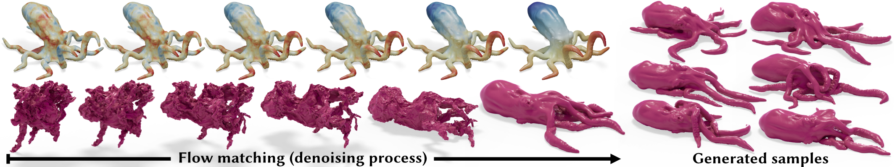

# Matérn Noise for Triangulation-Agnostic Flow Matching on Meshes

### [[Project Page]](link) / [[arXiv]](link) / [[Data]](https://udemontreal-my.sharepoint.com/:f:/g/personal/tianshu_kuai_umontreal_ca/IgDTIysjX7jBQa3RzqXL1TsBAePI1R2l0EUxTkIKThh3CKE?e=bCMkX2) / [[Data Generation Code]](https://github.com/kts707/matern-fm-data)



Official code release for [Matérn Noise for Triangulation-Agnostic Flow Matching on Meshes](link), by Tianshu Kuai, Arman Maesumi, Daniel Ritchie, and Noam Aigerman, published in ACM Transactions on Graphics (Proceedings of SIGGRAPH 2026). 

## Installation

```
# create conda environment
conda create -y -n matern_fm python=3.9
conda activate matern_fm

# install torch (other versions also work)
# install the version that works for your machine
pip install torch==2.1.2 torchvision==0.16.2 --index-url https://download.pytorch.org/whl/cu121

# install other dependencies
pip install -r requirements.txt

# install torch_mesh_ops
git clone https://github.com/ArmanMaesumi/torch_mesh_ops
cd torch_mesh_ops && python setup.py install
cd .. && rm -rf torch_mesh_ops

# install cholespy
git clone --recursive https://github.com/kts707/cholespy.git
pip install ./cholespy
rm -rf ./cholespy
```

## Matérn noise sampling
We provide stand-alone example scripts for sampling Matérn noise on a triangle mesh.

```
# Uses potpourri3d and cholespy
python matern_noise/sample_matern_noise_pp3d.py --mesh <mesh.obj> --screening_term 100.0 --sigma 5.0

# Uses torch_mesh_ops and cholespy
python matern_noise/sample_matern_noise_tmo.py --mesh <mesh.obj> --screening_term 100.0 --sigma 5.0
```


## Run our pre-trained models
Download our pre-trained checkpoints.
```
bash demo/download_weights.sh
```

Test our pre-trained models on the source meshes under `demo/meshes`. The generated deformed meshes are stored under `demo/results`. The SMPL human models are trained on a dataset of yoga poses, and the Stanford bunny and Fish models are trained on a dataset of elastic equilibrium states (see [Datasets](#Datasets) section for more details). 

```
# Single source model on SMPL
bash demo/single_source_smpl.sh

# Single source model on Stanford bunny
bash demo/single_source_stanford_bunny.sh

# Single source model on Fish
bash demo/single_source_fish.sh

# Arbitrary 3D human source model (trained on a dataset of yoga poses)
bash demo/arbitrary_source_smpl.sh
```

## Training

### Datasets
Download our preprocessed dataset files [here](https://udemontreal-my.sharepoint.com/:f:/g/personal/tianshu_kuai_umontreal_ca/IgDTIysjX7jBQa3RzqXL1TsBAePI1R2l0EUxTkIKThh3CKE?e=bCMkX2) and put them under `data` folder.

If you would like to create the datasets yourself, refer to PoissonNet's instructions on preparing the [SMPL](https://github.com/ArmanMaesumi/poissonnet/tree/master/smplx_data) dataset (yoga poses). We also provide scripts to create datasets by simulating the equilibrium states of an elastic object in this [repository](link). 

### Run training
All config files are stored in the `configs` folder. They assume training on a single NVIDIA H100 GPU (80 GB VRAM). To fit on a GPU with less VRAM, simply reduce the `batch_size` in the configs and enable gradient accumulation (`accumulate_grad_batches`) to keep the same effective batch size. 

```
# Single source model on SMPL
python train/train_single_source.py configs/moyo_fixed_source.yaml

# Single source model on Stanford bunny
python train/train_single_source.py configs/stanford_bunny.yaml

# Single source model on Fish
python train/train_single_source.py configs/fish.yaml

# Arbitrary 3D human source model
python train/train_arbitrary_source.py configs/moyo_arbitrary_source.yaml
```

### Test trained models

```
# Single source model on SMPL
bash test/test_single_source_smpl.sh configs/moyo_fixed_source.yaml single_source_test_results

# Single source model on Stanford bunny
bash test/test_single_source_stanford_bunny.sh configs/stanford_bunny.yaml single_source_test_results

# Single source model on Fish
bash test/test_single_source_fish.sh configs/fish.yaml single_source_test_results

# Arbitrary 3D human source model
bash test/test_arbitrary_source.sh configs/moyo_arbitrary_source.yaml humanoids_test_results
```

## Acknowledgement
The neural network architecture code was adapted from [PoissonNet](https://github.com/ArmanMaesumi/poissonnet), and the Flow Matching pipeline was from [Flow Matching](https://github.com/facebookresearch/flow_matching). A big thanks to their work and efforts in releasing the code.


## Citation

If you find our work useful in your research, please consider citing it:
```bibtex
@article{kuai2026matern,
author = {Kuai, Tianshu and Maesumi, Arman and Ritchie, Daniel and Aigerman, Noam},
title = {Matérn Noise for Triangulation-Agnostic Flow Matching on Meshes},
year = {2026},
booktitle = {ACM Transactions on Graphics (Proceedings of SIGGRAPH 2026)},
publisher = {Association for Computing Machinery}
}
```

## License

This project is under the MIT license. 